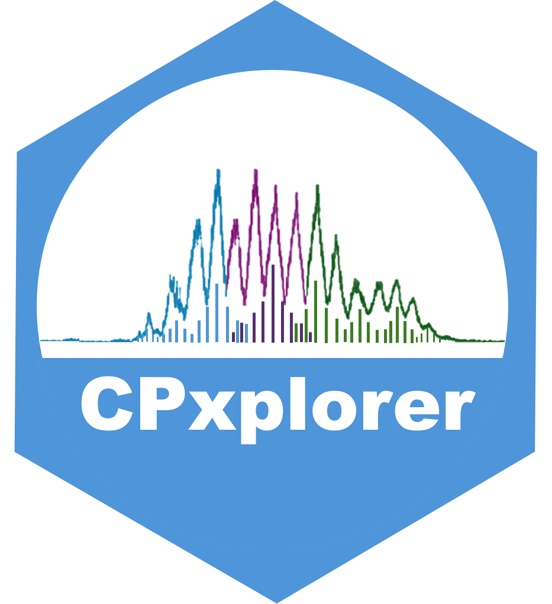

<!-- Knit this README.Rmd to generate README.md -->

# CPxplorer
  
<!-- badges: start -->
  
   

  
  
```{r, include = FALSE}
knitr::opts_chunk$set(
  collapse = TRUE,
  comment = "#>",
  out.width = "100%"
)
```
  
  
<!-- badges: end -->

CPxplorer is a workflow for targeted mass spectrometric batch analysis and rapid quantification of polychlorinated alkanes (PCAs) and related analogues. The workflow includes three modules:  
- CPions - generates a list of user defined adduct ions of PCAs and other related analogues, allow investigation of mass interferences based on mass resolving power, and export result to Skyline.  
- Skyline - is a free software for targeted analysis of proteins and small molecules (https://skyline.ms/).  
- CPquant - imports the integration results from Skyline and performs quantification based on deconvolution from standard mixtures. Also includes important QA/QC features.  

For details and citation, please read our publication:  
Beloki Ezker I, Yuan B, Borgen A, Liu J, Wang Y, Wang T. Streamlining Quantification and Data Harmonization of Polychlorinated Alkanes Using a Platform-Independent Workflow. Environmental Science & Technology, 2025, DOI: 10.1021/acs.est.5c04928.  


Detailed instructions on the quantifiation workflow can be found in the file: __CPxplorer_Manual.pdf__
  
  
### Installation
  
<!-- You can install the released version of CPxplorer from [CRAN](https://CRAN.R-project.org) with: -->

<!-- ``` r -->
<!-- install.packages("CPxplorer") -->
<!-- ``` -->
  
Example files and raw data can be found here: https://zenodo.org/records/19428486  


To install this R package directly from Github:  
``` r
install.packages("devtools")
devtools::install_github("WBS-TW/CPxplorer")

```
  
After installation, attach the package in RStudio by:  
``` r
library(CPxplorer)
```
  
These functions will then be available:  
`CPions()`: opens a shiny app to generate ions of PCAs and analogues.  
`CPquant()`: opens a shiny app to analyze and quantify output from Skyline.  
  
  
Server versions is available at shinyapp.io (this is a free tier account and therefore subjected to monthly limit for the server calculations):   
CPions: https://wbs-tw.shinyapps.io/CPions/  
CPquant: https://wbs-tw.shinyapps.io/CPquant/  
  
NOTE: the latest version is always installed using the devtools::install_github() function while the server versions might not be up to date with the latest version.  

<!-- ##SHINYLIVE DOESNT WORK YET##

The apps can also be opened directly in a web browser of the local computer from these sites (no need to install the R package and verified to work with Chrome):  
HOWEVER: Shinylive is still experimental and there are still some bugs.
  
https://wbs-tw.github.io/CPions_Shinylive/  
https://wbs-tw.github.io/CPquant_Shinylive/   
  


SOME KNOWN BUGS in Shinylive (but works in the R package and server versions):  
- CPions_Shinylive: _currently only export to excel the pages displayed in the panel (not the entire table)_  
-  CPquant_Shinylive: _currently Shinylive cannot export all results to excel, and the user is referred to the other versions for this functionality_  

-->
  
  

  
  


  
  
  


